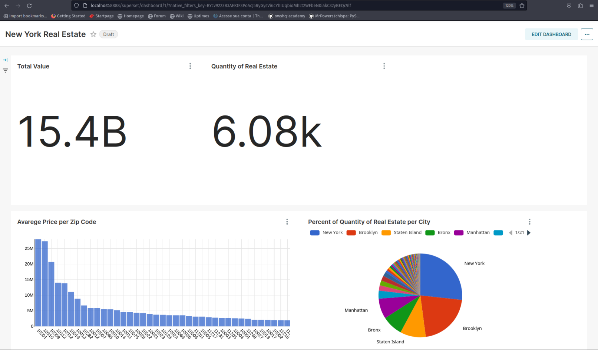

# Objective

Evaluate real estate data from the state of New York. 

A data scraping procedure was created for this purpose, and the data processing was made available in a data warehouse for data analysts to use.

# Data Architecture


# Proposal

## Data Scrap
There are three major obstacles.

Because the website is rendered in Javascript, accessing it without a browser will just provide insufficient HTML.

The website contains protections against numerous requests.

protections against bots

In order to fix this, we utilized Python, the Selnium library, Beautiful Soup, set a delay, and moved the mouse to simulate user behavior.

## Data Storage and Data Process

After being scraped, the data is saved in Min.io, which functions as object storage and uses the same AWS S3 protocol.

The data that was saved during the data scraping process was processed using Spark with Pyspark using the Bronze layer.

The silver layer is where we first type the data and do some minor adjustments before extracting information such as the unit, street name, zipcode, and other details since they are all contained in a single string.

Using the href of the property detail as the unique key, delete duplicate data from the golden layer.

The complete process is done with Spark using Pyspark.

## Data Warehouse

The data from the gold table was used in Clickhouse, an open source OLAP database, for the Superset to consume.

## Data Visualization

With the help of Superset's many database connectors, it is easy to connect to Clickhouse and generate graphs, dashboards, and even perform SQL data analysis.

## Run

You require docker and docker-compose in order to run the project.

```bash
docker-compose build .
docker-compose up -d 
```

Use Min.io at http://localhost:9001 to generate the bucket access keys.

Put the keys in docker-compose.yaml once they have been generated so that they can be used as an environment variable.

Replace <access_key> for Access Key
Replace <secret_key> for Secret Key

```bash
docker-compose down
docker-compose up
```


After the docker commands are run, the full infrastructure is uploaded, and data scraping begins, taking information from each page once every minute. Before running the after command, wait a few minutes for the data to appear in Min.io.

```bash
docker-compose exec -ti spark-master bash
spark-submit script/silver/silver_elt.py
spark-submit script/silver/extract_feature.py
spark-submit script/gold/gold_etl.py
```

The full ETL procedure will be finished after the commands inside Spark have been carried out.

Replace <access_key> for Access Key
Replace <secret_key> for Secret Key

Replace before run in Clickhouse

```bash
docker-compose exec -it clickhouse clickhouse-client
create database real_estate;
create table real_estate.ny
(
 full_address  Nullable(String),                                                                               
 lot_sqft      Nullable(Float32),                                                                              
 lot_unit      Nullable(String),                                                                               
 baths         Nullable(Float32),                                                                              
 beds          Nullable(Float32),                                                                              
 href          String,                                                                                         
 price         Nullable(Float32),                                                                              
 sqft          Nullable(Float32),                                                                              
 datetime      Nullable(String),                                                                               
 state         Nullable(String),                                                                               
 zipcode       Nullable(String),                                                                               
 city          Nullable(String),                                                                               
 address       Nullable(String),                                                                               
 address_type  Nullable(String),                                                                               
 address_unit  Nullable(String),                                                                               
 street        Nullable(String)                                                                               
 )
ENGINE = MergeTree
order by href;

insert into real_estate.ny
select * from deltaLake('http://minio:9000/data-lake/gold/real-estate/real-estate/','<access_key>','<secret_key>') where zipcode !='York';
```

Superset url `localhost:8888`

In Superset, you need to connect to Clickhouse

host: `clickhouse`
port: `8123`
user: `default`
password: `password`

After the connection you can create charts, dashboards or explore the data in SQLLab

To create Chart you need add the dataset the table real_estate.ny

Example of dashboard



